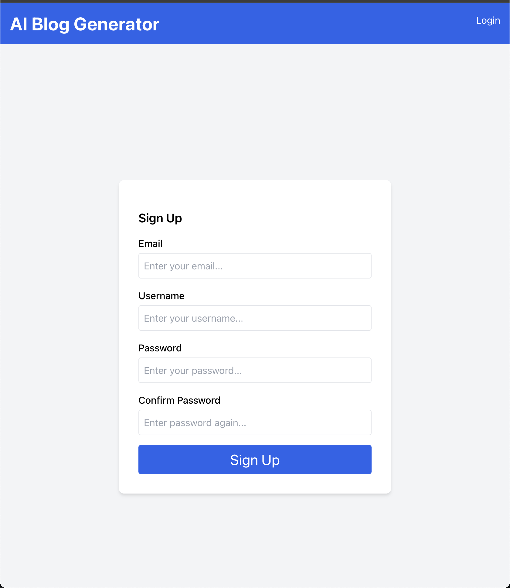
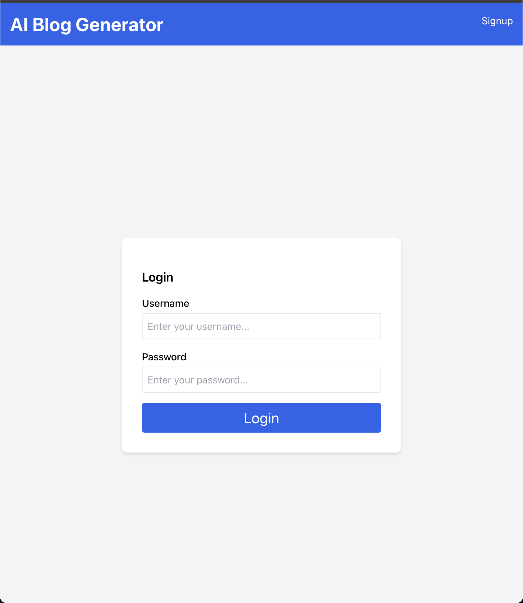
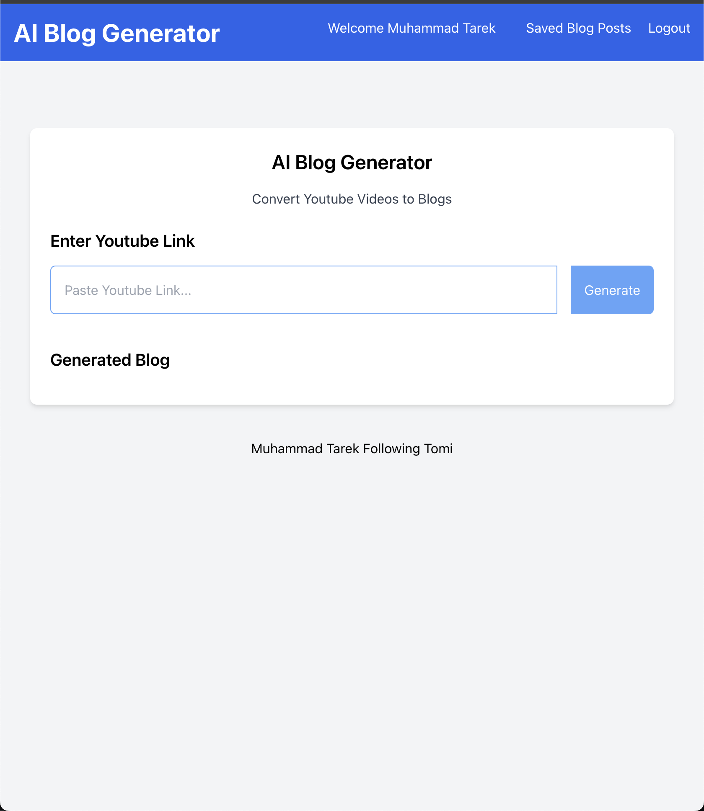

# AI Blog Generator

AI Blog Generator is a powerful tool designed to streamline content creation by automatically generating blog posts from YouTube videos. Using cutting-edge Django technology, this full-stack web application simplifies the process of video summarization, enabling users to transform lengthy video content into concise, readable blog entries effortlessly.

It's following [This Course](https://www.youtube.com/watch?v=ftKiHCDVwfA&t=146s) In [FreeCodeCamp](https://www.youtube.com/@freecodecamp) Channel

## Technologies Used

1. Django: Provides a robust framework for building web applications, offering features like ORM, authentication, and routing.
2. HTML: Used for structuring the frontend components and rendering dynamic content.
3. Tailwind CSS: Empowers rapid UI development with its utility-first approach, allowing for easy customization and maintainability.
4. JavaScript: Enhances interactivity and dynamic behavior on the client-side, enriching user experience.
5. OpenAI: Harnesses state-of-the-art natural language processing models to analyze and summarize video content, enabling seamless generation of blog posts from YouTube videos.

## Installation

```bash
pip install -r requirement.txt
cd ai_blog_app
python manage.py runserver
```

## Signup Screen



## Login Screen



## Main Screen

The main screen serves as the central hub for utilizing the AI Blog Generator's powerful capabilities. Users can input a YouTube video link into the designated field and then initiate the blog generation process by clicking the **Generate** button. Leveraging cutting-edge OpenAI models, the application swiftly analyzes the video content and produces a concise summary, ready to be transformed into a blog post. With a clean and intuitive interface, users can seamlessly navigate the process of content creation, empowering them to generate engaging blogs effortlessly.


